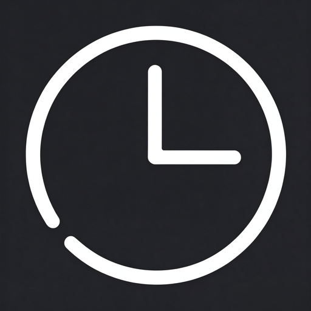

<p align="center">
  
</p>

<h1 align="center">TimeSense</h1>

<p align="center">
  <strong>A developer-focused productivity & wellness tracker</strong><br />
  Know exactly where your time goes.
</p>

<p align="center">
  <a href="README_ZH.md">简体中文</a> |
  <strong>English</strong>
</p>

<p align="center">
  
  
  
  
</p>

---

## About

TimeSense is a lightweight desktop app that automatically tracks which applications and windows you use, classifies them into categories via customizable rules, and turns raw activity data into actionable insight — without getting in your way.

Built with Tauri 2 + Vue 3 + Rust + SQLite. All data stays on your machine.

## Features

- **Automatic activity tracking** — monitors the active window and process every 2 seconds, no manual timers to start
- **Rule-based categorization** — map processes / window titles to categories with regex rules; unmatched activity falls back automatically
- **Pomodoro timer** — focus / break cycles with an auto mode that detects focus sessions and switches categories for you
- **Idle detection** — configurable threshold marks you idle when you step away
- **Rich analytics** — overview dashboard, category breakdown, daily timeline, trends, and a yearly heatmap
- **System integration** — tray icon, auto-start on boot, native notifications, close-to-tray
- **Privacy first** — local SQLite storage only; nothing is uploaded anywhere

## Screenshots

> TODO: add screenshots of Dashboard / Timeline / Heatmap

## Installation

1. Download the latest `TimeSense_0.1.0_x64-setup.exe` installer from [Releases](https://github.com/sleepy-ailurus/time-sense/releases)
2. Run the setup and follow the installation wizard
3. Launch TimeSense — it lives in your system tray

> Requires Windows 10 or later.

## Development

Prerequisites:

- [Rust](https://www.rust-lang.org/tools/install) (stable toolchain)
- [Node.js](https://nodejs.org/) 18+

```bash
git clone https://github.com/sleepy-ailurus/time-sense.git
cd time-sense
npm install
npm run tauri dev
```

Build a production package:

```bash
npm run tauri build
```

## Project Structure

```
src/          # Vue 3 frontend (views, router, API layer)
src-tauri/    # Rust backend (monitoring engine, SQLite DAOs, Tauri commands)
docs/         # Documentation assets
```

## Contributing

Bug reports and pull requests are welcome at [Issues](https://github.com/sleepy-ailurus/time-sense/issues).

## License

TBD
